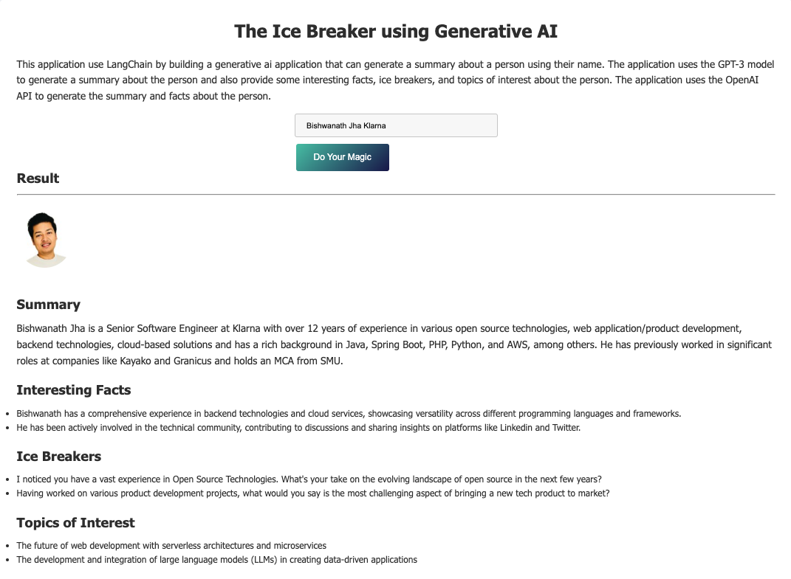

# Ice Breaker LangChain
This application use LangChain to build a generative ai application that can generate a summary about 
a person using their name. It's crawling Linkedin & Twitter data about the given person. Further it uses the 
GPT-3 model with the data to generate a summary about the person and also provide some interesting facts, ice breakers, 
and topics of interest about the person. 

The application uses the OpenAI API to generate the summary and facts about the person.



## Environment Variables

To run this project, you will need to rename the existing `.env.sample` file to `.env` and populate the values of environment variables

```
OPENAI_API_KEY=sk-xxxxx -- from openai.com
SERPAPI_API_KEY=xxxxxx -- from serpapi.com
PROXYCURL_API_KEY=xxxxxx -- from nubela.co/proxycurl
TWITTER_API_KEY=xxxx -- from developer.twitter.com
TWITTER_API_SECRET=xxxxxx
TWITTER_ACCESS_TOKEN=xx-xx
TWITTER_ACCESS_SECRET=xxxx
TWITTER_SAMPLE=1 -- If you want to avoid the api call to twitter and use sample date from inbuilt function
```

## Run Locally
Clone the project

```bash
  git clone https://github.com/bishwanathjha/ice-breaker-langchain.git
```

Go to the project directory

```bash
  cd ice-breaker-langchain
```

Install dependencies

```bash
  pipenv install
```
Run

```bash
  python ice_breaker.py
```
OR Use it from UI (using Flask server)

```bash
  python app.py
```


